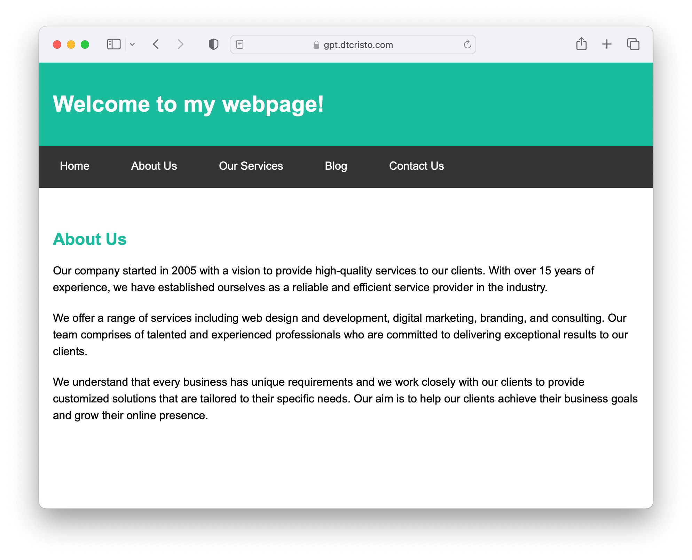

<div align="center">
  <h1>
    gpt-html
  </h1>
  <p>
    <strong>
     GPT website generator
    </strong>
  </p>
</div>

## About

A website where the HTML content for any given request path is generated by [GPT](https://en.wikipedia.org/wiki/Generative_pre-trained_transformer) using the [OpenAI API](https://platform.openai.com/). Inspired by [LiveOverflow's video](https://www.youtube.com/watch?v=M2uH6HnodlM) building something similar.

The application is deployed at [gpt.dtcristo.com](https://gpt.dtcristo.com/) but it is protected by HTTP Basic authentication. Please contact me directly if you want the credentials to try it out. Otherwise, get your own OpenAI API key from [platform.openai.com](https://platform.openai.com/) and run it yourself.

<div align="center">
  <a href="https://gpt.dtcristo.com/">
    
  </a>
</div>

## Usage

Requires a Ruby environment, tested with Ruby 3.2.

```sh
# Set OpenAI API key as environment variable.
export OPENAI_API_KEY="your_api_key_here"

# Install dependencies.
bundle install

# Start the web server.
bundle exec puma
```

Application live at [localhost:9292](http://localhost:9292/).

## License

Licensed under either of

- Apache License, Version 2.0 ([LICENSE-APACHE](LICENSE-APACHE))
- MIT License ([LICENSE-MIT](LICENSE-MIT))

at your option.
